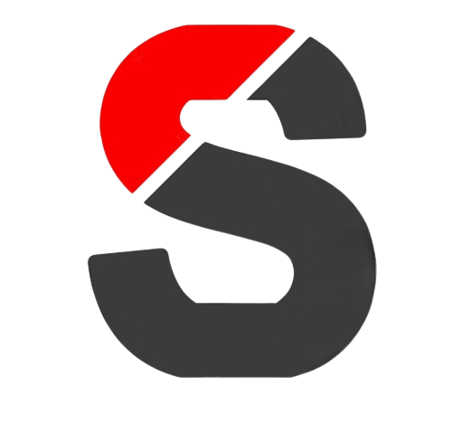
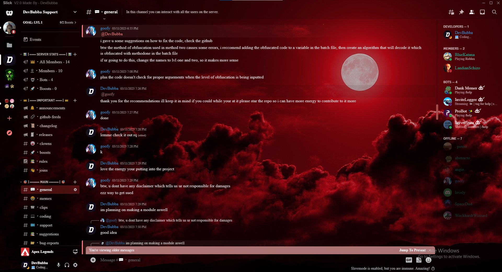
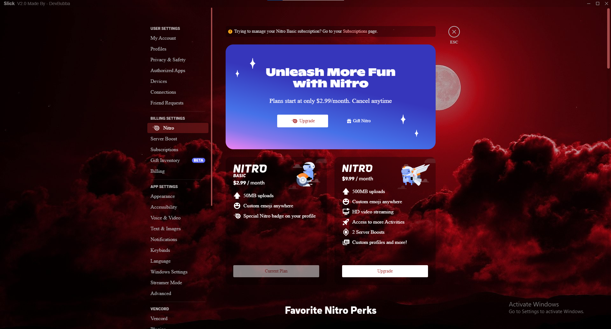

  

    
    
     
     
    
     
    
    
     

#  💻 〢 Slick

### The Best Discord Theme Out There! This Theme Is Red, Black, Modern, And Slick Making It The Best Theme To Use For Gaming And Feeling Amazing On Your Eyes After A Long Day!

## 🌐 〢 Table Of Contents

- **[📖 〢 Description](#description)**
- **[🔰 〢 Features](#features)**
- **[🔗 〢 Discord](https://discord.gg/6qAvAephsW)**
- **[📥 〢 Install](#install)**
  - **[💻 〢 Prerequisites](#prerequisites)**
  - **[⚙ 〢 Setup](#setup)**
    - **[🔌 〢 Vencord](#vencord)**
- **[📷 〢 Preview](#preview)**
- **[⚠️ 〢 Bugs Or Errors](#bugsorerrors)**
- **[🧾 〢 Lisence](#lisence)**

##  🔰 〢 Features

- `Customizable`🟢
- `More Than One Font`🟢
- `Dark Red`🟢
- `Lightwieght`🟢
- `Multiple Obfuscation Choices`🟢
- `Add Even More Fonts`🟡
- `Make A Light Mode Option`🟡
- `Watch Stream Button Loading Properly`🔴

🟢 = Working  | 🟡 = To Do  | 🔴 = Not Working

##  📥 〢 Install

###  💻 〢 Prerequisites

-   Windows 7/10/11
-   Linux
-   **[Discord](https://discord.com)**

###  ⚙️ Setup

####  🔌 〢 Vencord

1. Make Sure You Have Vencord Installed And If Not You Can Install It **[Here](https://github.com/Vencord/Installer#usage)** With Further Inscrutions On How To Do That There
2. Copy The Raw URL Of `main.css` **[Here](https://raw.githubusercontent.com/DevBubba/Slick/main/main.css)**
3. Go Into Your Settings Scroll Down And Find Themes Under The Catigory Vencord
4. Paste The Raw URL Into The Text Box That Says `Theme Links`
5. Enjoy Your New And Improved Discord Theme!

##  📷 〢 Preview

    
    
    </img>
    </img>
    </img>
    
 

##  ⚠️ Bugs Or Errors?

-   To Report An Error Make An **[Issue](https://github.com/DevBubba/Slick/issues)**
-   Or Join The **[Discord](https://discord.gg/6qAvAephsW)**

## 🧾  License

### Slick is licensed under the <a href="https://mit-license.org/.">MIT License</a>

